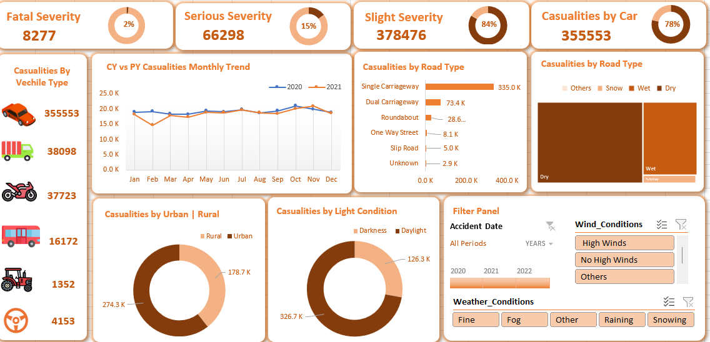

# 🚗 Road Accident Dashboard

## 📌 Objective
To analyze road accident data and identify patterns in accident severity, vehicle involvement, and environmental conditions, enabling data-driven decisions to improve road safety.

---

## 📊 About Dataset
The dataset contains detailed road accident records including:
- Accident severity (Fatal, Serious, Slight)
- Vehicle types involved
- Road types and conditions
- Weather and wind conditions
- Light conditions (Daylight/Darkness)
- Urban vs Rural locations
- Monthly trends across years

This dataset helps in identifying high-risk factors contributing to road accidents.

---

## 🛠 Tools & Technologies
- Microsoft Excel / Power BI
- Power Query (Data Cleaning & Transformation)
- Data Visualization

---

## 📈 Key KPIs
- **Total Casualties:** 462,051  
- **Fatal Accidents:** 8,277  
- **Serious Accidents:** 66,298  
- **Slight Accidents:** 378,476  
- **Casualties by Car:** 355,553  

---

## 📊 Dashboard Preview

---

## 🔍 Key Insights

### 1. Accident Severity Analysis
- Majority of accidents are **Slight (~84%)**
- Serious accidents contribute ~15%
- Fatal accidents are relatively low (~2%)

### 2. Vehicle Type Analysis
- Cars account for the highest number of casualties
- Bikes and goods vehicles show significant involvement
- Heavy vehicles contribute comparatively less

### 3. Road Type Analysis
- Most accidents occur on **single carriageways**
- Dual carriageways and roundabouts have fewer incidents

### 4. Road Condition Analysis
- Majority of accidents occur on **dry roads**
- Wet conditions contribute a smaller share
- Extreme weather conditions have minimal impact

### 5. Urban vs Rural Analysis
- Rural areas show higher casualties than urban areas
- Indicates higher risk due to speed and infrastructure

### 6. Light Condition Analysis
- Most accidents occur during **daylight**
- Fewer accidents during darkness

### 7. Time Trend Analysis
- Accidents remain consistent throughout the year
- No significant seasonal spikes observed

---

## 🚀 Features
- Interactive filters (Year, Weather, Wind Conditions)
- Dynamic KPI tracking
- Multi-dimensional analysis (vehicle, road, environment)
- Clean and user-friendly dashboard design

---

## 💡 Business Impact
- Helps identify major causes of road accidents
- Supports government and traffic safety planning
- Enables data-driven policy decisions
- Improves awareness of high-risk conditions

---

---

## 👩‍💻 Author
Anshika Patel
